# 📈 一起学习可视化图表库 AntV F2 及字节小程序适配

> 文章发布索引：
>
> - 公司内部文档库
> - 公司内部技术社区
> - 字节前端 ByteFE 官号：
>   - 微信：https://mp.weixin.qq.com/s/THqhjN0xTnQlltAXtAPxLQ
>   - 掘金：https://juejin.cn/post/6909409932747997191/
>   - 知乎：https://zhuanlan.zhihu.com/p/339073120

> 个人源码阅读、学习实践过程的记录输出。如有错漏之处，恳请不吝赐教。
>
> —— 2020.10

## 0. 导读

这篇文章是对蚂蚁金服可视化团队 Antvis 的开源图表方案 F2 的源码阅读，还有该库的一大背景——图形语法的了解学习。我们会从实际需求背景出发，谈到图表方案大的背景、图形语法这个阵营的基本思想，然后进入 F2 源码的简要分析，其大致的学习分析思路是：整体架构划分 —— 各模块分工 —— 重要模块设计实现。源码分析过后，又回到需求背景，记录了在特定的需求场景中，如何运用了解到的知识和背景解决实际问题——图表库的小程序环境适配。

希望这篇文章在使大家对 F2、图形语法有基本了解的同时，能成为源码阅读过程中的一个助手，也能利用其带来的 context 给大家的技术选型、技术实践带来帮助。

更详细的文章内容，可以在下一部分，正文中的 `README.md` 中看到。接下来先交代清除整个学习过程的大背景，这起源于一个业务需求……

## 1.有始有衷

> 写下本文的起因、初衷（谐音梗扣钱，成语原样应该是：有始有终）

### 1.1 npm install @antv/f2

“我有一个新需求不知当提不当提……”

业务上的细节不多讲，大致的需求关键词如下：

- **移动端数据看板**
- **字节小程序**为载体
- **交互式图表**

业界有非常多优秀的图表库方案，如百度的 ECharts（现在应该叫 Apache 的 ECharts 了？）是业界的老大哥，拥有更广泛、更活跃的用户群体和社区。但是对标移动端小程序的成熟图表库几乎还没有，上面几个关键词一出，蚂蚁可视化团队的一个年轻项目 F2 基本就被锁定了。

### 1.2 README.md

**会**涉及的

- 图形语法之九牛一毛：一组概念、很多图表
- F2 设计、图形语法封装简析
- 模块/能力实现方案（交互式、动画）
- \*Canvas 实践、优化策略

**不会**涉及的

- F2/G2 API 罗列或总结
- 业界图表库的横向对比
- Canvas 更底层的渲染原理
- 可视化中的数据处理

本文大部分内容出于自己在项目启动和实现过程中，对图表库的接入和源码学习。同时，会稍微拓展到一些通用的可视化基础、图形语法概念、还有从通用到 F2 实际实践的绘图策略，当然就少不了要提到主要依赖的渲染引擎 Canvas 了。

Linus Torvalds: "Talk is cheap. Show me the code."

虽然但是，我们不会直接看很多代码。项目的维护者都是蚂蚁的前辈，许多注释是中文的，加上库本身的设计和模块划分清晰简洁，看起来蛮直观、蛮好懂的，所以只要把各个模块还有逻辑讲清楚，实际上已经达到学习和初步了解的目的。也推荐大家有兴趣的话可以看看 [仓库源码](https://github.com/antvis/F2)，一方面必要的地方注释到位，而且代码自注释这一点也做得很好（毕竟连我都能看懂）。

也应该划定没有涉及的内容，首先我们可能会有一些小的演示，但不会聊很多具体的库 API，这个不太具有通用性和普适性；同时，因为也只是图表库的入门用户，体验不深不广，还没有足够的资质去做深入客观的横向比对和评价；另外，我们的视角会放在 Canvas 渲染引擎这一层以上，所以也不会涉及 Canvas 更底层的内容；最后，我们还不会聊到数据处理，包括数据载入时的预处理、adjust 功能等，这也是一个大话题，并且牵涉到的数学和统计学成分过高，不敢乱动。

## 2. 有史有衷

> 项目历史、设计初衷、架构演进（扣钱 again）

### 2.1 google.com/search?q=visualization

在 F2 的前辈 —— G2 的设计文档中有这么一句话： **“将数据映射到图形，同时增加一些辅助信息，让用户读懂数据。”**

这反映了可视化的本质，还可以从其中梳理出可视化的一般性流程：

- 数据处理：对数据的加工，使数据更具有内在逻辑，对人类本身、或者算法、或者图像处理需求提高可理解性；
- 图形映射：从数据，到位置 / 大小 / 颜色等具有区分度的信息的 map；
- 图形展示：点线面，在各种媒介上的渲染；
- 辅助信息：视觉通道跟数据之间的映射关系，可能是一些参照、一些标准，如坐标轴、图表中的图例、更进一步的辅助文本等。

可视化领域中的一大阵营扛着 **「图形语法」** 大旗，我们先对其先来点大致体会、感性认识。

#### 2.1.1 The Grammar of Graphic

它是一本想要为图形学、数学、计算机科学这个交叉领域建立系统化描述的著作，同时也是学术界非常具有分量的作品。作者是一位统计学家，所以用非常严密的形式化的系统描述，来建立模型和自我论证，就有蛮多让人头秃的数学，所以内容比较不好懂，没能完整看下去（有机会还是应该啃一啃），但有一些关键概念我们可以有大致的感性体会。

单拎我们的主题，图表这一块来讲，图形语法将图表的这个数据呈现概念看作「数据」和「几何图形的视觉特征」绑定的结果，图表本身，可以被认为是相互正交的特征组合而成的结果。这个概念也是我们在使用类似 G2、F2 这样的图形语法封装库中能很直观体会到的。

直接来认识一下两个正交的概念：

**Visual Cue 数据点特征**：Position 位置、Length 长度、Angle 角度、Direction 方向、Shapes 形状、Area or Volume 面/体积、Color 颜色（Saturation 饱和度、Hue 色相）

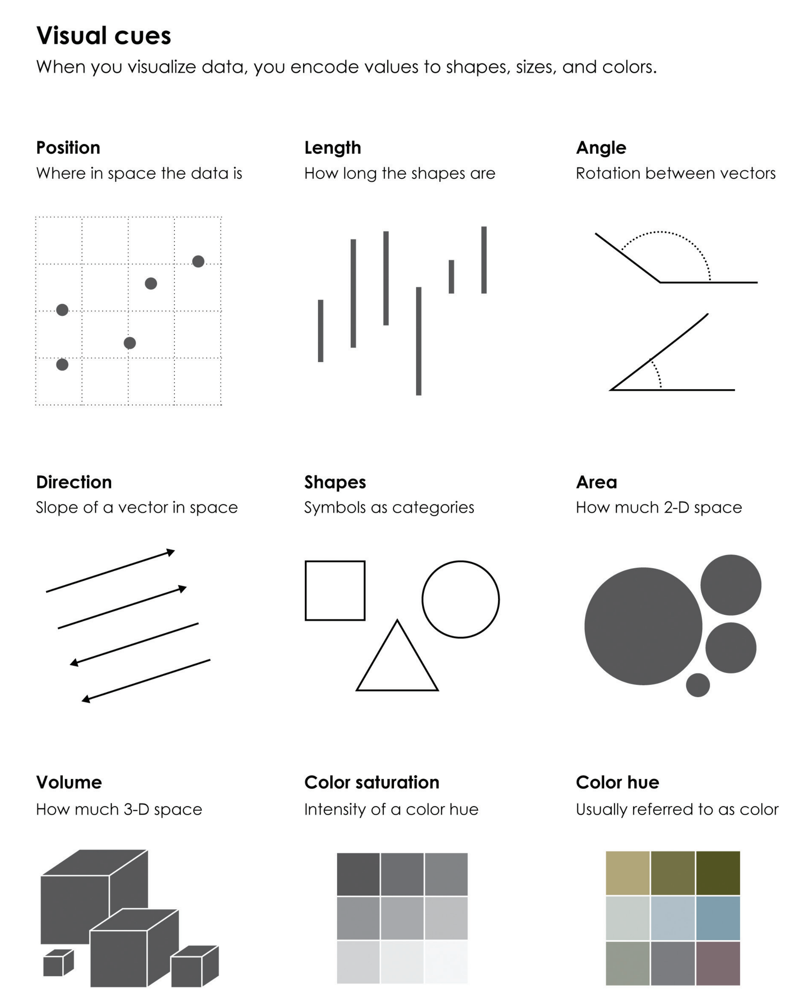

**Coordinate 坐标系**：Cartesian 笛卡尔坐标系、Polar 极坐标系、\*Geographic 地理坐标系（地理坐标系在我们的图表库中常常单独抽出，如同是蚂蚁 antvis 的 L7）

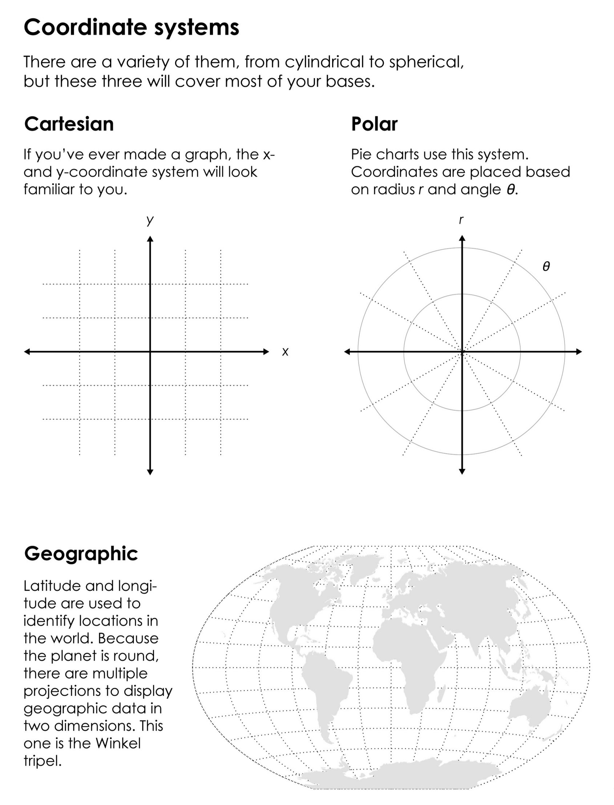

将上面两者进行 **正交** ，组成描述能力丰富的图表们：

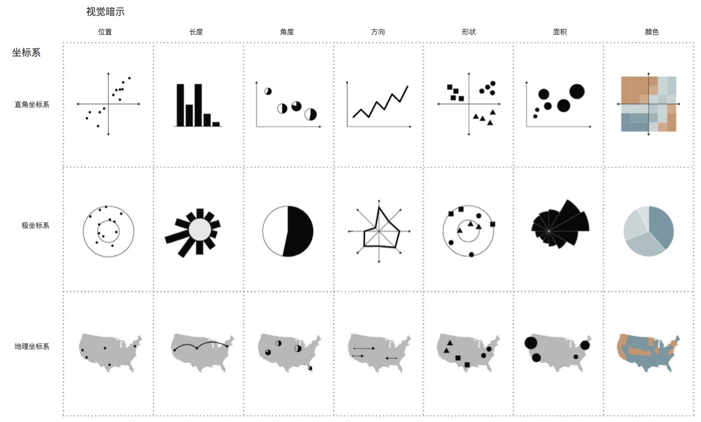

_以上三张图源：[Data Points 讲义 (英文版正交图被分开故使用中文版素材图)](http://flowingdata.com/data-points/DataPoints-Ch3.pdf)_

- 这样的设计和归纳，使基于图形语法封装的图表库不同于其他的“零售”式、“授人予鱼”式的图表（即按直观的图表类型作为直接接口，进行配置化的图表开发，如大哥 ECharts），G2、F2 有一套自己的表示系统，图表开发者可以用其进行图表描述。
  - 但并不是说这两种阵营有孰优孰劣之分（“没有说其他图表不好的意思”）
    - 图表语法本身是比较完备一种思想、一个描述体系，并非实现标准，事实上其本身的学习成本也是不低的；
    - 基于此的图表库也一样，一开始上手使用的时候有点反直觉，学习曲线比较陡峭，跟想象中的配置化图表差别较大，同时前期也常常很难从文档找到想了解的内容；
    - 图表库也是产品，也需要考虑用户体验，使用门槛，所以肯定也要找到平衡点；
    - 类型化的图表库相比之下或许显得啰嗦、不通用、描述能力稍差，但又更容易做到体积压缩，符合用户直觉地简易按需引入和针对性优化；
    - 大家都在聊 noCode, lowCode，当前业界一些可视化平台使用的图表依赖还是倾向于 ECharts 等，会不会配置化的图表在这样的应用场景下更受青睐，或者反之是具有系统描述性的语法更容易接入？可以留为我们的开放性问题。

#### 2.1.2 antvis G2 - Grammar of Graphic

要聊 F2 ，先说说 G2。G2 是 antvis 的第一代图形语法封装库，G2 就取自 The **G**rammar of **G**raphic 里面俩 G。2014 年启动，17 年底开源的 G2，其引以为傲的图形语法理论基础，也是受到上面提到的 The Grammar of Graphic 作者的直接肯定的。

它在蚂蚁内部的前身也是常规的图表库，后来发现这样的图表库和已有的巨头 ECharts、HighCharts 定位重叠，同时自身的开发拓展也很麻烦，容易遭遇瓶颈，加之数据分析大户 R 语言 ggplot2 流行，图形语法的概念为人了解，蚂蚁的前辈希望调整方向，这时其初衷和目标，就变成了一个图形语法封装的可视化工具库了。

G2 不是本文的重点，我们简单看看其发展，14 年下旬启动图形语法库 G2 的正式开发，G2 的基础架构经历了如下的演进：

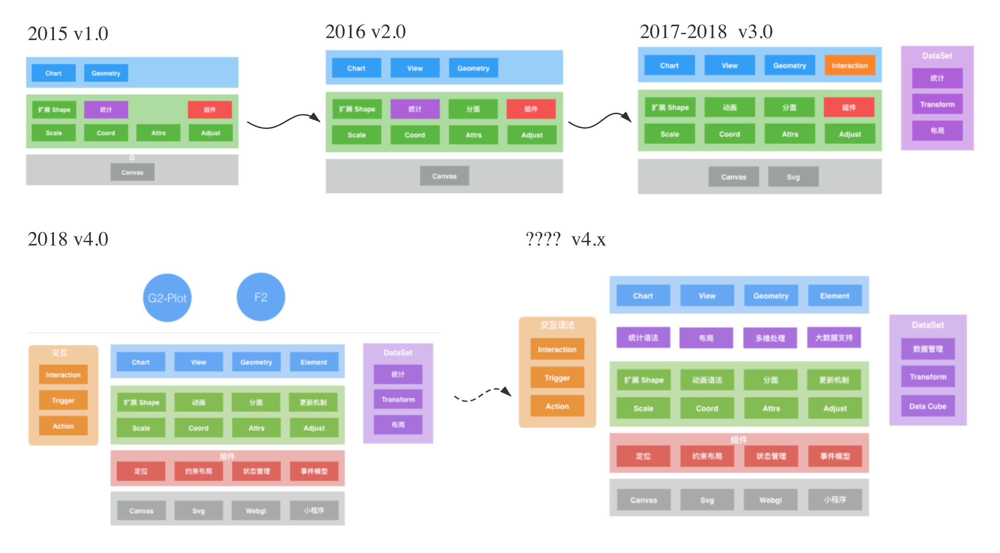_图源：[G2 官方介绍](https://antv-g2.gitee.io/zh/docs/manual/concepts/history)各代架构设计拼接_

经过至今 (2020) 六年的发展，G2 本身也有很多调整，比如底层引擎从单一 Canvas 到 SVG、Webgl 的支持，交互、数据处理模块的抽离、顶层图表应用库的进一步封装，“螺旋上升”到后面又想要做整合，F2 可以从 G2 打包产出，直接从底层渲染引擎彻底兼容多端等，设想和设计都是非常有野心的，期待能有 ECharts zRender 那样优秀的更多设计出现～

#### 2.1.3 antvis F2 - Fast, Flexible

F2 也是来自需求，服务于需求。15-16 年支付宝钱包业务发展，移动端的资金展示需求冒出。移动端钱包，在代码大小上非常受限，所以 AntV 团队开始基于已有的 G2，自研面向移动端的图表库，一开始叫 G2-Mobile，跟老哥 G2 用的是同一套架构，只是上层实现有一些差异，但这也带来了较高维护成本和一些麻烦。一直到 3.0 时代，G2-Mobile 才成熟起来，设计、架构方面都进行升级，更名 F2，“复用”了 G2 的命名语义，取自两个 F-words，不是“脏话”，而是 Fast 和 Flexible。至于为什么 Fast 和 Flexible，后面的设计例子和 demo 使用中我们可以体会一下。

发展至今，我们在项目中用到的 3.7，其架构大概是这样的。如果说到更远，就是跟上面 G2 一起谈的“大团结”了。

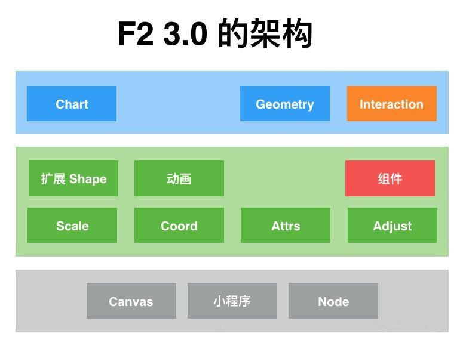

先来体会一下这个库的基本使用，两三行代码应该就有图形语法的味道了。希望如此。

### 2.2 code .

我们直接上官方 demo 吧。

https://antv-f2.gitee.io/zh/examples/basic

在上面的地址中，大家可以动手一起直观体会一下 F2 的使用。

```
// 前面引包、创建 Chart 实例、载入数据都不消多说，直接看到最关键的图形描述语法

// 一行代码画图表
// 常规柱状图
chart.interval().position('genre*sold').color('genre');

// 改成二维坐标散点？
chart.point().position('genre*sold');

// 配置？搞点内个颜色
chart.point().position('genre*sold').color('#face15');

// 上面提到的都是我们的 Visual Cue 概念，它是很容易改变的，再来个折线
chart.line().position('genre*sold').color('#ffee15');

// 只有 Visual Cue，Coordinate 怎么说？
chart.coord('polar');

// 不太好看？改点属性
chart.source(data, {
  sold: {
    min: 0,
    max: 500,
  }
});
```

## 3. 走码观画

> 架构模块简析、浏览代码看看人家怎么画图的（扣钱 again and again，成语原样应该是：走马观花）

### 3.1 git clone git@github.com:antvis/F2.git

架构图信息量可能有点不足，直接读一读各个模块里面的代码，看看分别负责了什么工作，模块之间的数据流又是怎么样的。为了方便理解，我们需要自底向上地看这张架构图：


#### 3.1.1 底层 Canvas/小程序/Node

指的是不同环境下的绘图引擎，对其的依赖主要是两件事情：

- 通过绘图命令进行渲染，这个不消多说，各个环境下的适配也首先在这一步完成；

- 事件系统，在第四部分我们会仔细聊到一个设计。

#### 3.1.2 中间层

**Shape**

- 这个模块直接连接了单个数据点到 Canvas 上的绘制过程，可能稍显复杂啰嗦。如果我们看源码，会发现 F2 的 Shape 有两种：
- Graphic 基础图形中的 Shape —— 渲染引擎中的 Shape 实现，这是 3.x 版本中 F2 对渲染引擎的完全改造，跟原有的 G 是匹配的。具体的详细介绍可以看到这个 [F2 渲染引擎文档](https://www.yuque.com/antv/f2/api-g)
  - Graphic 层的 Shape 是底层的“图形”概念，提供了与绘图引擎 Canvas 的连接桥梁。整套 Shape 使用 OOP 中的常用来举例子的那种典型继承关系进行设计，大致层次为：
    - 基类 Element 维护了绘图元素这个概念，维护自身层级、可见性属性，实现元素绘制中如矩阵变换、移动的方法，通过重新计算其绘图点坐标实现，（父类维护公共属性、基本方法）
    - 扩展 Element 实现的有两个概念
      - Shape：内置图形（包括图片）的基类，做这一层包装是对基础图形的统一，对外暴露统一的绘制和包围盒获取方法，但方法中调用的具体的路径创建、包围盒计算方法交给各个具体的 Shape 如 rect, circle, line 去重写
        - 具体 Shape：矩形、圆形、线等具体图形按照自身形状特征 override 绘制路径、包围盒计算接口
      - Group：组合图形类，是对基础图形的“打包”处理，包围盒合并、统一创建销毁
  - Graphic 的 Shape 还允许用户扩展添加自定义图形，丰富绘图引擎能直接支持的绘制基础图形。用户只需要定义图形的绘制路径和包围盒计算即可，与具体内置图形的方式相同，graphic 会使其继承自 Shape 创建，可以在绘图引擎中和其他图形一样直接使用
- Geometry 中的 Shape —— 数据的直接映射（图中的数据柱子、数据散点）
  - Shape 使用工厂模式的设计，各个具体图形通过在这个工厂中注册，代理 Geometry 中的具体图形（数据点特征 Line/Point/Interval 等）接口，然后实现对应 geom 的绘制方法，这个绘制方法就是调用 Graphic 中具体 Shape 的路径绘制，添加到画布上。Geom 部分内容在下面的 Geometry 模块还会具体涉及

**Animation**

- 动画实现，F2 提供了注册式的动画入口，支持自定义动画处理。同时内置了许多默认动画，支持对图表中的数据元素 Shape 出现、更新、隐藏的过程添加动画，且支持许多内置的缓动函数。是一个相对独立的模块，在第四部分中我们也会讨论一个设计细节

**Component**

- 顾名思义，组件。这部分的内容比较杂，实现的是一些绘制图表过程中可以抽象出来固化的通用成分，称为组件
- 如坐标轴、HTML（为用户可以自行添加的 HTML 辅助元素提供一个配置入口，主要做的是帮忙创建节点、映射 CSS、画布中布局）、文本、列表、Tooltip 悬窗展示的视图组件
  - 听起来应该是 Shape 或者 Plugin 呀？
    - Shape 应该是数据在图中的体现和代表，是能体现数据特征的，虽然 component 也有自己的渲染、包围盒计算逻辑，但应该跟 shape 有概念上的区分
  - Plugin 应该要有自己独立的状态管理逻辑，注册并寄生于 Chart 主体之上，而非一个纯视图组件，跟 component 有别
    - 这些 component 的使用方正是图表组成如坐标轴和 plugins 如 Tooltip、Legend

**Scale**

- 度量，它表示的是数据在图表上的展示方式，这部分内容也已经抽离出 F2 本身，作为额外的[工具仓库](https://www.npmjs.com/package/@antv/scale)，但是作为支持绘图的一个中间模块，应该了解一下
- 度量提供的是可视化图表中数据信息对图像信息的映射标准，可以把源数据某个维度的空间范围比作定义域，转换后的图形属性空间比作值域，其间的转换桥梁就是 scale
- 可以支持我们对分类、时间（离散或连续）、连续数据、分段数据等进行转换和过滤
- 通俗来说，就是最后图表上面某个轴向应该对数据做怎样的增删改，我们在演示中载入数据，设定了 sold 字段值的最大最小值，就是在手动更改它的 scale
- 抽离这个概念有利于实现坐标轴和数据图的对应联动

**Coordinate**

- 坐标轴类，拓展实现了 cartesian 笛卡尔直角坐标系和 polar 极坐标系
- 两种坐标系各自实现不同的 convertPoint 和 invertPoint 函数，根据坐标系规则，处理归一化后的点数据并返回结果坐标，满足对应的绘图需求（归一化也是一个重要的设计，我们在聊 Geometry 时将聊到）

**Attributes**

- 是所有视觉通道的管理类，视觉通道，是可视化编码的关键
- 点线面这样的几何形状可以实现一种标记，标记帮助人眼进行分类、聚合识别
  - 而如坐标轴（一维、二维）位置、颜色、形状、角度、长度这样的视觉通道是实际数值在视觉上的映射，实现定性/定量效果；分类 + 定量，才产生了可视化的效果
- attrs 类，主要是提供一个基类，实现数据到视觉通道的映射，对外暴露获取绘图数据的接口，如控制位置、透明度、颜色等，使用方是后面要提到的 Geometry，它控制着每个数据到我们所见的图案的映射

**Adjust**

- 顾名思义是一种“调整”工具，这是 antv 系数据处理能力的一种数据工具封装，[主体](https://github.com/antvis/adjust)也已经拆分出去了，主要用于将原始数据做可视化层次上的一些修整，使其绘制出来的图表更具有可看性
- 为满足不同图表的数据呈现需求，当前支持四种方法：
  - stack 层叠：如层叠面积图、层叠柱状图
  - dodge 分组散开：分组并在范围内均匀分布，如分组柱状图
  - jitter 扰动散开：可以使原本的分类数据中同一类的多个数据实体打散，使其保留分组效果但不重叠，如分组散点
  - symmetric 对称：使数据对称呈现，如漏斗图，河流图

#### 3.1.3 顶层

**Geometry**

- 先看看这个大类，它是绘制各种图形的基础。图形语法两个正交概念中，数据的直接映射——图形就是由 Geometry 控制
- Chart 初始化的时候，会将各种 geoms 初始化，并把其中每个基础 geom 的绘图命令挂载到 Chart 上，成为 Chart 的可调用方法，如刚才的示例中我们用 line 方法创建折线图、用 point 方法创建散点图，都是直接调用了 Geometry 中通过 Line、Point 提供给 Chart 的方法
- Chart 初始化 geoms 的时候也维护了当前 geoms 列表，后续 Chart 对数据在图表中的映射元素的维护，都通过这个 geom 实例列表进行。Chart 会告知 geom 数据信息、用户配置、坐标轴信息等绘制的必要数据，而且会将 geom 的 container 限制为其绘制层次中的 middlePlot，中间层中。后面会介绍到这个分层模型
- 完成了数据和配置的下发、方法到 Chart 上的挂载，geom 在数据初次载入或者变化时会进行一系列：
  - attrs 处理，一些绘图属性的设置和维护
  - 数据处理，包括：
    - 从基础数字字面量到 [0, 1] 范围的归一化，从而实现图表整体的数据统一，方便绘制；
      - 归一化是一个比较巧妙的设计，获取到数据并通过 scale 确定绘制范围后，会得到数据维度上的值域，将每个数据进行归一化操作，得到一种类似“比例”的数据，再根据画布区域大小映射成具体的像素位置，这个简要的过程实现了数据的准备，将数据范围限定为一个 0-1 间的数，为各个模块消费数据、坐标轴转化、绘图转化提供了方便
    - adjust 数据调整，以满足不同的图表数据呈现需求；
    - 数据排序。

**Interaction**

- 移动端主要的交互是 touch 系列，这个模块对事件系统做了进一步包装（事件系统的底层模拟在后面的第四部分会详细介绍），对比如 touch 事件组合形成的 pan 平移、pinch 缩放、swipe 轻扫等事件的具体处理做了包装，方便按需引入

**Chart**

- 图表主体基础，数据载入、语法运用的入口
- Chart 类从一个 F2 自己实现的事件系统扩展而来，通过简单的 eventListener 维护还有 on/off 和 emit 对应挂载卸载、触发事件，实现整个图表的通信和各个模块的联动
- 对于除了图表主体之外的各种辅助插件，如 Tooltip 悬窗、Legend 图例等采用注册机制
  - register 的时候把 chart 对象传入，插件可以自己独立配置、维护状态、完成渲染，像 Tooltip 的交互也通过事件系统来实现，各个插件自行注册处理函数到 Chart 上一起处理
  - Chart 只需要维护 plugins 列表，Chart 可以通过这个列表在事件钩子触发时对各个 plugin 进行 notify，插件自己对全局的这些事件进行自定义的响应，更新状态

### 3.2 What happened?

当我们创建一个 Chart 实例、载入数据、创建图形语法命令、最后触发 render 的时候，发生了什么？

#### 3.2.1 new Chart()

- initCanvas 根据传入信息，包括 canvas 实体 / 上下文 / DOM 元素，还有宽高、pixelRatio、字体族，创建 Canvas 对象，这个对象封装了实际的 Canvas 对象，实现事件通信，暴露绘制、resize、销毁接口，后续的底层绘制都在此基础上进行
- initLayout 布局初始化，Canvas 作为图表整体基类，需要管理图表的数据映射、坐标轴、辅助信息、标题、图例等的布局，这一步结合用户自定义的和默认的配置进行布局
- initLayers 创建 Chart 的分层模型，通过在 Canvas 上添加绘制组，实现图表画布三层的分层结构
  - 坐标轴主要在底层，数据映射部分（折线、散点、柱）在中间层，辅助信息如辅助线、浮窗，主要在顶层
  - 这只是概念上的分层，实际上 F2 依赖的还是单一的 Canvas，没有分层次，这样只是给概念上的操作带来了方便。在移动端小图的场景下，同时维护三层 Canvas，还要保持对齐、处理重叠，成本比处理交叉重绘更高
- initEvent 全局 Chart 需要管控的事件注册，主要是数据更新和图表整体 resize 时的触发和必要的重新计算，其他事件会由其他组件管控
- initScaleController 为数据各个维度的值域映射专门创建了 controller，初始化时应该挂载上，并维护 Chart 的 scale 配置
- initAxisController 坐标轴这个实体的 controller 挂载，为的是将初始化完毕的三层结构中顶部和底部告知坐标轴管理器，以便后续绘制

#### 3.2.2 chart.source(data)

- Chart 本身 data 状态 set
- 如果同时传入了 scale 配置，会调用 scaleController 对各字段 scale 配置进行增量的修改，并更新所有受影响的配置，更新方式是全量的，拿到每个 field 数据，重新进行映射
- 数据归一化处理会在具体的 Geometry 中，上面我们提及了

#### 3.2.3 chart.interval().position().color()

完整的 Geometry API 示例应该是这样的：

```
// Type 可以是 point 点，line 线，interval 柱等等，其实概念应该是更抽象的 Visual Cue
chart.<geomType>()
// 字段解析，通俗易懂：x*y / [x, y] 表示以数据的 x 维度和 y 维度分别为横纵轴
 .position()
// 绘图属性：大小、颜色、形状
 .size()
 .color()
 .shape()
// 其他工具：数据调整、Canvas 绘图属性、动画
 .adjust()
 .style()
 .animate();
```

- Geometry 接管创建数据映射图形的命令，以上面的语句为例：
  - 初始化 Interval 柱状图实例，解析带进来的参数，与默认配置 mix 生成绘制配置
  - 解析字段 field，确定以数据源中什么字段名作为数据的各个维度，同时还会更新 scale，它直接影响拿到数据后的绘制范围、粒度
  - 绑定更多配置化的绘图属性，如图案大小，颜色，填充形状
  - 进行数据调整、绘图属性、动画添加
- 这些 API 操作的过程，其实都是维护该 geom 内部 config 对象的过程，它本质就是一份配置数据，更新完毕确定之后，在 render 的时候才根据这些配置项目进行绘制

#### 3.2.4 chart.render()

- 初次渲染的初始化操作：触发数据过滤器，过滤器是一个列表，由交互定义添加，比如 Legend 插件，在点击条目的时候会触发数据维度的显示或隐藏，这时候需要维护过滤逻辑；初始化坐标轴并挂载到 Chart 上；额外操作如多坐标轴对齐、数据 adjust 等
- 渲染坐标轴，Chart 会从 Geometry 这个管理数据映射的部件中拿到当前数据的 scale 信息，比如笛卡尔坐标系中会拿 X Y 两轴的基本信息，这保证了坐标系和数据的联动性。过后 axisController 自己根据数据创建坐标轴，使用前面提到的 axis 组件，按需渲染，将需要渲染的图形添加到 Canvas 上
- 开始处理中间层，为中间层创建 canvas clip，将后续 Geometry 的绘制限制在这个子画布内，过后逐个触发 geoms 的 paint，这里的 paint 其实也是假绘制，并没有真实开始渲染，而是将每个图形的路径和绘图属性都配置好，添加到 canvas 上
- 开始处理顶层，首先要对顶层内容进行一遍排序。这里的排序 F2 通过对每个图元自身的 zIndex 进行维护，同时在绘制之前进行排序，zIndex 升序，后面绘制的会自动覆盖前面的
- 如此就完成了三层内容的层叠添加，并且保证了顺序，最后会调用 canvas.draw 开始绘制，呈现完整图表

#### 3.2.5 简单说说更新绘制

在上面的流程中可以看到，F2 在图表渲染过程中统一开了一些口子（比如一些事件全局 emit、主动检查的部分共享配置数据等），方便插件或者交互、动画能力引入干预绘制过程和绘制效果。所以图表更新和交互渲染也是不难理解的：

- 图表数据更新流程大致相同，因为重叠，基本都要触发挺多重绘的，但是 AntV 有一些重绘时的优化，如[局部渲染](https://juejin.im/post/6844904103231881229)，可以减少损失
- 交互产生的更新，通过插件实现：

🌰1⃣️： Tooltip 插件通过配置项告知 Chart 是否需要在顶层添加 Tooltip 元素，并且通过交互判断控制自身的生命周期。

比如在监测到手指点按的时候，拿到事件，计算点击区域获取应该展示的详细信息，使用 Component 提供的基本绘图组件载入数据进行获取绘制信息，将绘制信息载入 canvas 图层配置中，同时触发 canvas.draw 重绘，重新计算顶层需要渲染的元素，此时新增的项目也被加入，就完成了绘制。

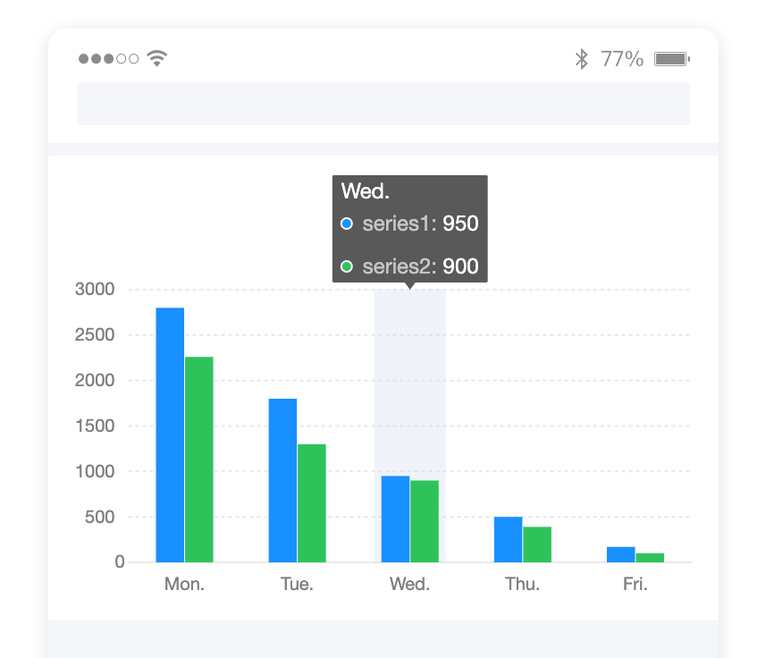

🌰2⃣️：Legend 点击筛选，在 3.2.4 中提到了。chart render 时会走一层数据过滤器，这层过滤器是 Legend 插件可以干预的，Legend 在发生交互（如用户点击下图的 men 条目使其置灰，当前的筛选状态就被更新到数据过滤器中，chart 重新渲染时数据即被剔除。

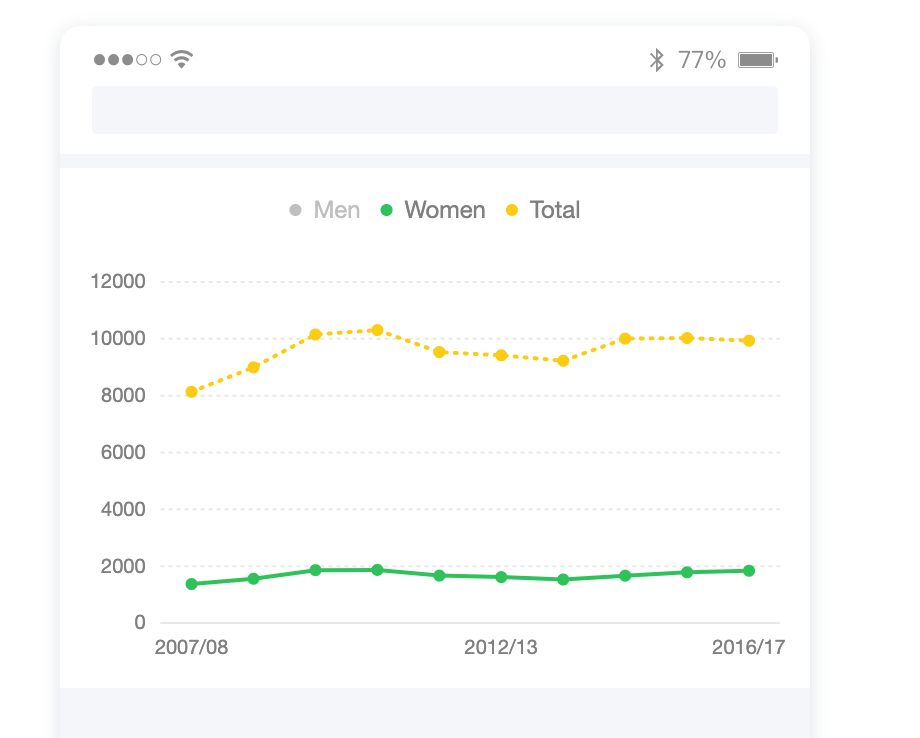

## 4. 略探一二

> 玩不动谐音梗了（x，来细看两个关键的设计细节：交互 & 动画

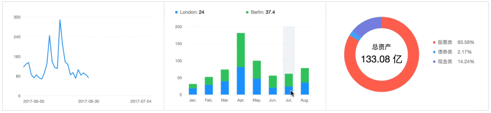


_图源：F2 仓库中 README 示例_

### 4.1 「交互式」怎么做

Overview first, Zoom and Filter, then Details-on-Demand.

F2：概览第一，聚焦过滤，再按需查看详情。这是数据的展示链路，而交互就是其中的重要串联线索。

F2 默认依赖的渲染引擎是 Canvas （毕竟只是二维图表，更猛的 WebGL 不谈，Canvas 和 SVG 的抉择可以看到 AntV [这篇文章](https://g2-v3.antv.vision/zh/docs/manual/tutorial/renderers)），Canvas API 标准提供的是一种 immediate-mode API，与之相对的是 retained-mode API，简单理解这两种模式就是，前者就像白纸，API 调用就像一笔一笔往上面画图案，画上去了就拆不开了；后者就像乐高，一张图可能有其本身的层次结构，内部的结构状态是被保留下来的，可以类比我们更熟悉的 DOM 结构。

在 Canvas 这种“即时”绘图的环境下，并不能知道当前画布上面用户动作意欲交互的节点/元素，其实根本没有所谓节点和元素的概念，整张画布就是一张 bitmap，所以元素的概念需要图表库来维护。

移动端最基础的交互事件是“点击”“触摸”，如何扩展出一套完整的，支持包括图表交互需要的：缩放、平移、轻扫、手指停留预览、选中等交互，也是需要解决的问题。

所以要实现交互，需要解决两个问题：

- 如何接受原生的交互事件，包装成图表库可以消费的更完整的事件系统——EventController；
- 如何将交互事件映射到实际并不存在的元素概念；

我们先看比较直观易懂的第二个问题可以怎么解决。

#### 4.1.1 从最简单的元素点击事件开始

具体事件触发先不管，先看看已知某事件触发，知道热点坐标，如何处理

**算！**

- 画几个不重叠的千姿百态的圆
- 维护一个数组保存圆的信息
  - 点击时从整个 Canvas 元素的点击事件拿到点击热点在元素内的坐标 clientX/Y
  - 逐个判断圆心到热点的距离和半径的关系可知是否点击了某个圆
  - 知道是某个圆了，交互就好说啦
- 重叠怎么办？底层优先？顶层优先？
  - 只需要控制遍历图形数组时的顺序、是否“懒遍历”（找到一个就返回）

**Trick**

- 一个 Canvas 画布其实是一张 bitmap，对于一个点击位置，该像素的色值是最直接的信息，需要的计算量很少
- 获取颜色，然后可以认为用户点击了该颜色的图形
- 颜色碰撞？可以用一层看不见的离屏 Canvas 同步绘制同位图做交互层，每个元素生成一个随机不重复的颜色，透明度可以在离屏 Canvas 屏蔽
- 重叠问题？只能实现顶层优先的交互事件，或者再维护重叠颜色；透明度？难顶；多层 Canvas？难顶；
- 但是可以支持更复杂的不规则图形

**各有优劣——结合使用**

- 简单图形：算
- 复杂图形：能简化？简化，算；不能简化？取色
  - 取色的代价只在绘制时要渲染两层，后续交互速度很快

F2 中使用的主要还是第一种方式，因为 F2 的移动端交互情况都不太复杂，交互精度要求低，图表 Canvas 实体也不会太大，简单的几何图形包围盒计算就可以满足需求了。

#### 4.1.2 触摸点定位能做了然后呢

原本是依赖于 hammer.js，这个锤子就是专门处理移动端手势交互的，特别是多指触控等的交互支持。但是因为它还依赖浏览器环境，这对希望全平台适用的 F2 来说是一个缺陷，所以 F2 也在慢慢脱离这个库。自己实现了一套多指触控。目前应该还是逐步迁移的阶段。但是其实现思路比较简单清晰。

理论上，只要可以解决判断当前鼠标/手势交互发生在哪个“元素”上，其他事件都可以模拟了。同时，面向移动端的 F2 其实比常规的 PC 端图表要处理的交互判断更简单：

- PC 端有虚拟指针，所以有 hover、move、click、drag 等事件需要处理
- 移动端只需要处理 click 和 touch
- 关于 [Click & Touch](https://developer.mozilla.org/en-US/docs/Web/API/Touch_events/Supporting_both_TouchEvent_and_MouseEvent)
- touch(start, *move, end, *cancel x) --> mouse (1move, down, up) --> click
  - 先触发 touch 事件，其中有起始 start，可能有 move，终止的 end 或者异常终止的 cancel，cancel 将 block 后续的事件触发
  - 后触发 mouse 事件，分别是唯一的 move 和后续紧跟的 down 和 up
  - 最后触发 click 事件

F2 自己实现一个 Controller，通过 touch 系列事件监听，模拟出完整的手势操作。没有太多高深的技术，设计逻辑也比较清晰，但代码比较难提炼，而且现在还是逐步脱离 hammer.js 的兼容阶段，可能有点难理清楚，所以这里画了一个交互流程的时序图，一起看看怎么模拟手势交互：

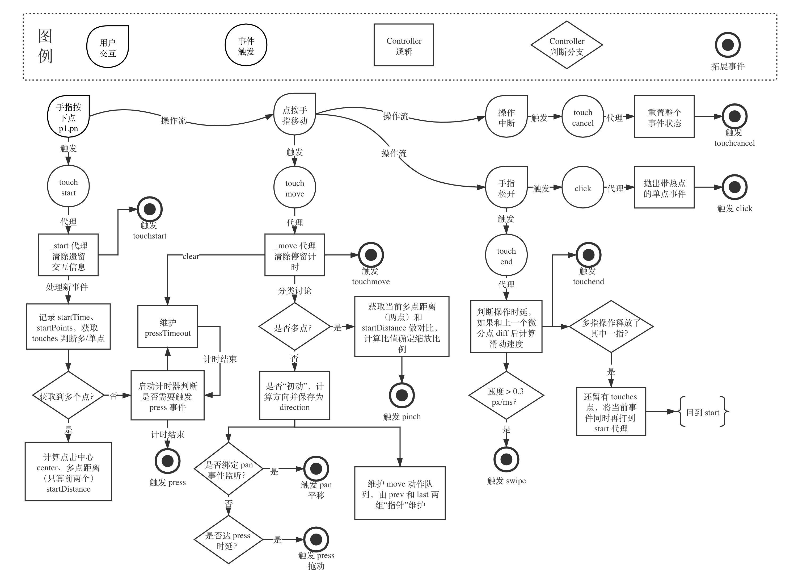

- 一些细节、要点笔记：
  - 这个 Controller 帮 Chart 层屏蔽了 Canvas 本身的事件处理，包括交互序列、速度、点数不同导致的不同操作判定，都封装成单个事件，这样处理响应会非常方便
  - 所谓代理，其实是对每个事件添加自定义的 EventListener，代理后原事件会再被抛出，这里就省略了
  - 多点触控事件中，会有 touches 属性保存所有点信息；单点事件则只有一个单一的 point
  - 拓展事件，通过库自身实现的简易事件管理抛出的。在这一层只需要处理好整个 controller 逻辑和事件流程，剩下的交给上层消费这些事件：press、pan、pinch、swipe。触发这些事件的时候 Controller 会按序触发 start 和 end，并在 processEvent 标记该事件的进行。

我们已经解决了落点计算、事件包装，那当交互事件发生，我们的事件消费就可以进行了：针对需要响应的事件进行监听，过后经过判断进行额外渲染即可。

### 4.2 「动画」怎么做

通俗易懂：动画在我们这样的数据展示类日常图表中，可能对于数据的实际展示、分析辅助作用并不是很大，但它是提升用户体验，提高图表本身的高级感的重要工具。

F2 中动画的主体是表示数据映射图形的 Shape，我们前面说过 Shape，维护的其实是自身的位置、关键点、绘图属性等数据，动画，就是通过逐帧改变 Shape 的属性来实现的。

很多关于自定义动画、默认动画的内容，逻辑比较复杂就不详细讲了。我们讨论一个关键问题：在前面提到的渲染模式中，动画这个过程是如何勾入整个 Chart 的 render 中的？

要解决这个问题，有两个关键的背景知识需要了解：

#### 4.2.1 缓动函数 easing function

动画的实现中，动画速度常常是控制动画效果的一个重要维度，需要有多种方法支持动画进行的速度跟时间的关系映射，这样的方法就是缓动函数。为了支持多样性的动画，F2 自身内置了一系列缓动函数。当前大致包括：

- 一次线性缓动（可以理解为匀速）；
- 二次、三次缓动（包含淡入、淡出、淡入淡出）；
- 弹性缓动（包括回弹、定位抖动、反弹）；

找到一个缓动效果的展示，可以在 [这里](https://www.xuanfengge.com/easeing/easeing/) 或者 [这里](http://sole.github.io/tween.js/examples/03_graphs.html) 看到缓动曲线还有动画效果，鼠标 hover 在对应的函数图之上，会有一个光标，它的移动速度可以表示该缓动函数实现的速度控制效果。

#### 4.2.2 插值器 interpolator

插值器也是动画领域一个比较重要的概念了，不详细展开，而且其在我们简单的二维动画中并不复杂，大致了解一下其背景和用途即可。插值器常常是用于创建所谓“补间动画”的工具函数。在 F2 中，主要支持了两种类型的插值：

- 纯数值的插值，用于创建如透明度、大小、一维位置之间变化的补间；
- 矩阵插值，用于创建如散点位置变化、矩阵变化的补间。

插值器的形式大概是接受起始和终止两个状态，生成一个可以接收一个表示整个动画进度的参数 t，返回该进度下数据中间值的函数，用最简单的数值插值器来举例就好了（下面代码片段来自 F2 源代码）：

```
function interpolateNumber(a, b) {
  a = +a;
  b -= a;
  return function(t) {
    return a + b * t;
  };
}
```

返回的函数接收一个 t，表示当前进度，这个函数可以用于计算 a ---> b 的数值变化中，经过时间 t 之后的数值情况。这里的 t 是用当前动画已经执行的时间 t' / duration 算出来的比值。如果用 4.2.1 中提到的缓动函数再对 t 包装一层，就实现了数值变化的缓动。

#### 4.2.3 逐帧渲染

帧的概念，由 requestAnimationFrame 来触发

- 这里 F2 做了一个适配，浏览器环境下，存在 requestAnimationFrame 方法，则直接使用，不存在的话会 fallback 使用 setTimeout(fn, 16) 代替，近似达到每秒 60 帧效果。

当我们初始化一个动画时，是创建了一个 Animator 类，它的 constructor 需要三个参数，这可以帮我们大致理解动画的执行框架

- 动画的对象 Shape（是各个代表数据的图形在进行着动画）
- Shape 自身属性 Attrs 作为动画的内容（动画内容是图形的大小、形状、颜色、位置等随时间的逐帧改变）
- 需要动画效果的主体自己保留的 timeline 对象，这个对象可以实现动画生命周期控制

Timeline 对象是控制动画执行的最小单元，受到全局默认注册的动画管理器的控制。管理器会默认将全局的 Shapes 动画添加到 Timeline 的动画队列中，当监听 Canvas 将开始刷新，就会开始“播放动画”，动画播放完毕，达到改变化阶段的最终状态，canvas 更新也就结束了，就会“停止播放”

- 动画事件，是由 Animator 对象的 to 方法发出的，常见的形式是将某个 Shape 的当前状态 animate to 某个新的状态，创建动画的时候可以从此获知起始和终止状态，明确这个动画的过程是要改变哪个 Shape 的什么属性，耗时多久，这就创建了一个动画事件
- Timeline 控制器，就是对动画事件的消费。首先它会维护时间轴，动画播放过程中通过 requestAnimationFrame 不断调用自身的 update 函数，update 函数更新当前时间，检查动画队列，逐个取出事件，判断动画执行进度，如果还在进度中，则使用上面提到的缓动函数和插值器计算动画进度，将动画对象的属性更新为获取到的插值，这时候 Canvas 中的图形信息就更新了，整个动画事件队列遍历完之后，调用 Canvas 的 draw 方法进行更新，就实现了动画效果
  - 这个过程中 Timeline 也承担了部分动画队列的维护工作，如果消费过程中，发现有些 Shape 已经被销毁了，则其动画也不应该再维护，Timeline 会将其从列表中移除
  - 如果 Timeline 检查进度发现某动画已经执行完毕，则还是保留动画事件，下次更新可能还要执行，但本次 update 可以跳过了

所以，其实我一开始的想法不准确，不是动画过程“勾入” render 过程，而是动画作为 canvas 绘制过程中的“点缀”，在图形变动时作为一个中间过程，由 Timeline 进行控制和渲染。

## 5. 水土不服

> 为什么、怎么做、做咋样
>
> 适配包 tt-f2 (命名取自 F2 官方的微信适配包 wx-f2，针对头条/字节跳动小程序的适配) Github [地址](https://github.com/PieNam/tt-f2)

### 5.1 症结

当我们在字节小程序上直接引入并开始使用 F2 这个图表语法库来画图表，我们会很开心地看到：

|                 卖家秀                 |               买家秀               |                喜庆控制台                |
| :------------------------------------: | :--------------------------------: | :--------------------------------------: |
| 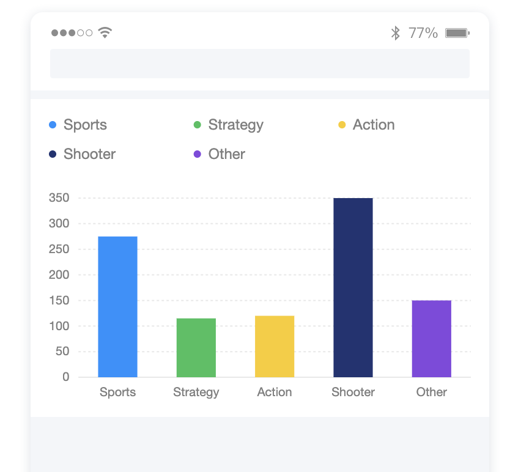 | 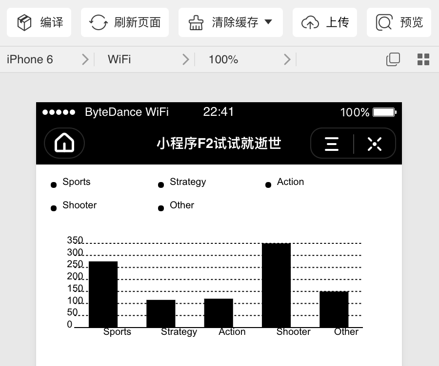 | 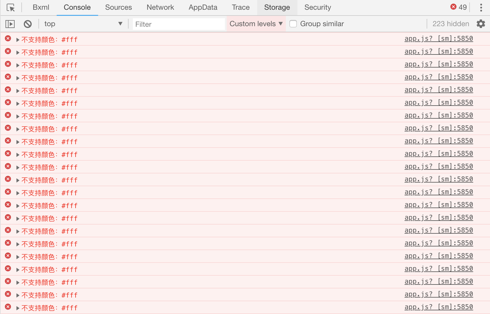 |

### 5.2 病理

既然图形、大致的图表框架，甚至图例、数据映射都已经画出来了，说明图表库本身的运行是基本 OK 的，并且按照我们前面的源码学习，F2 基本是纯 JS 环境下运作的，相关依赖也在逐渐减少，所以绘制表现异常，颜色丢失，很有可能是底层绘图 API 的问题。实际上官方在对微信小程序做的适配中也提到，理论上只要提供了同样的 Canvas 运行环境，就可以正常完成图表绘制。

带着这个问题，我们先看看 HTML5 标准和我们的小程序给出的 CanvasContext 有没有什么 GAP：

（注：以下数据对比是截止 2020.10 的数据。HTML5 Canvas 标准来自[ MDN](https://developer.mozilla.org/zh-CN/docs/Web/API/CanvasRenderingContext2D/canvas)，字节小程序接口来自[小程序官方文档](https://microapp.bytedance.com/docs/zh-CN/mini-app/develop/api/interface/canvas-draw/canvas-context/)。同时，HTML5 标准中实验性、已废弃、未标准化的属性或方法已被忽略）

| HTML5                                                                                                                                                                                                                                                                        | ByteMP                                                                                                                                                                                                                                                                                             |
| :--------------------------------------------------------------------------------------------------------------------------------------------------------------------------------------------------------------------------------------------------------------------------- | :------------------------------------------------------------------------------------------------------------------------------------------------------------------------------------------------------------------------------------------------------------------------------------------------- |
| 属性                                                                                                                                                                                                                                                                         |                                                                                                                                                                                                                                                                                                    |
| fillStyle、globalAlpha、lineCap、lineJoin、lineWidth、miterLimit、strokeStyle、textAlign、textBaseline                                                                                                                                                                       | 未提供可写属性，但有对应的 set 接口                                                                                                                                                                                                                                                                |
| font                                                                                                                                                                                                                                                                         | 没有可写属性或 setFont()，但有 setFontSize()                                                                                                                                                                                                                                                       |
| lineDashOffset                                                                                                                                                                                                                                                               | 可以在 setLineDash 的第二个参数进行设置（库中未用到）                                                                                                                                                                                                                                              |
| shadowBlur、shadowColor、shadowOffsetX、shadowOffsetY                                                                                                                                                                                                                        | 可以在 setShadow(number x, number y, number blur, string color) 中统一设置                                                                                                                                                                                                                         |
| globalCompositeOperation、imageSmoothingEnabled                                                                                                                                                                                                                              | 没有对应可写属性<br />globalCompositeOperation 影响图形合成，文档中说常用，但没有在源码中找到<br />imageSmoothingEnabled 影响图片抗锯齿、平滑效果，没有在源码中找到<br />依赖库中也没有，只有 uglify 或者 terser 中有，忽略                                                                        |
| 方法                                                                                                                                                                                                                                                                         |                                                                                                                                                                                                                                                                                                    |
| arc、beginPath、bezierCurveTo、clearRect、clip、closePath、createLinearGradient、drawImage、fill、fillRect、fillText、lineTo、measureText、moveTo、quadraticCurveTo、rect、restore、rotate、save、scale、setLineDash、setTransform、stroke、strokeRect、transform、translate | API 一致、支持                                                                                                                                                                                                                                                                                     |
| arcTo、createRadialGradient、createPattern、drawFocusIfNeeded、ellipse、getImageData、getLineDash、getTransform、isPointInPath、isPointInStroke、putImageData、strokeText、                                                                                                  | 未提供对应 API：<br />arcTo、drawFocusIfNeeded、ellipse、getImageData、getLineDash、getTransform、isPointInPath、isPointInStroke、putImageData 绘图未用到，依赖库中常有 polyfill 或者 fallback<br />createRadialGradient 影响环形渐变<br />createPattern 影响纹理创建<br />strokeText 影响文字描边 |

做完如上整理之后，我们基本可以断定 demo 图表样式出现问题，是绘制的时候可写属性全部失效导致。至于小程序环境下方法上的一些 GAP，调研之后发现影响不大，主要是环形渐变、纹理绘制、文字描边这三块功能有无法避免的缺失，其他没有对齐的 API 在 F2 源代码中都没有用到。

至于这样的没有与 HTML5 标准对齐的 API 设计的初衷，尤其是绘图属性不支持可写的问题，通过了解和咨询，得知这样的设计出于以下的一些考虑：

1. Canvas 组件从基础库 1.0.0 开始支持，为了降低小程序开发者的迁移成本，基础能力的设计基本和微信小程序对齐，微信小程序的 Canvas Context 绘图属性可写特性也是 18 年 2 月左右，基础库 v1.9.90 之后才支持的。
2. 这样的设计可能也和小程序与 Web 的差异有关。我们知道小程序视图组件和 JS 逻辑分别运行在渲染层 (webview) 和逻辑层 (jscore) 中，Canvas 绘图指令的实现涉及从 webview 到 jscore 的通信，提高运行性能，做了属性设置和绘制的分离，set[[propName]] 只是将操作放入 action 列表，真正的绘制要调用 draw API，统一执行，以此减少频繁通信的情况。

另外，还有一个小问题。刚才控制台输出了一片红色报错，都是形如 不支持颜色：#fff 的报错信息。这是因为字节小程序不支持 RGB 颜色的 HEX 简写。这个问题根源比较简单。

### 5.3 偏方

#### 5.3.1 先挑软柿子捏

RGB 的 HEX 简写（形如 #ffff00 ---> #ff0），在库源码各处都有，在 ECharts 之类的其他库也是如此。没办法通过什么配置项目来覆盖掉。但我们可以进行代码替换：

- 这样的 HEX 简写以字符串的形式出现在库源码中，并且都是以 # 开头，紧跟三个 HEX 字符
  - 正则表达式匹配：/#([0-9a-fA-F])([0-9a-fA-F])([0-9a-fA-F])(['"])/g
  - 将其替换为：'#\$1\$1\$2\$2\$3\$3\$4' 的形式
  - 其实就是很粗暴地把中间的三组单个缩写拆出来还原为两位，并保留原来的井号和结尾引号
- replace 插件支持对指定文件夹内容进行扫描替换，使用上方正则匹配替换即可
  - npm 在 script 中提供了 postinstall 关键字，可以在这个钩子中加入命令，运行替换脚本

搞掂！

```
// package.json
"scripts": {
  "postinstall": "node ./util/hexFormatter.js"
}

// hexFormatter.js
const replace = require('replace');
replace({
  regex: /#([0-9a-fA-F])([0-9a-fA-F])([0-9a-fA-F])(['"])/g,
  replacement: '#$1$1$2$2$3$3$4',
  paths: ['../@antv/f2'],
  recursive: true,
  silent: true,
});
```

这个做法有点小问题还没有深究：npm 中正常运作，如果使用 yarn 作为包管理器，在更新包或者安装其他包之后，原有的替换操作会被还原回去，大致推测是 yarn 会判断 node_modules/\* 是否被篡改，并且还原时不会触发 postinstall 脚本。

#### 5.3.2 抹平 Canvas 差异

经过上面的 API 调研和 diff，清楚了 Canvas 上下文环境的差异所在。方法上的 GAP 目前没有比较好的方案去填平，但是因为许多接口 F2 并没有使用，而少数缺陷产生的影响，在常见场景中基本可以忽略，所以小程序 Canvas 的方法基本是可以承载绘图需求的。

当务之急是解决小程序完全没有提供可写属性的问题。所以希望能够将对 CanvasContext 中属性的写请求变成对小程序 CanvasContext 中一系列 set 接口的调用，答案就比较明显了，就是将写请求代理出来，手动调用接口。说到代理，那 ES6 的 Proxy、Reflect，或者是最原生的 defineProperty 都可以做。其实这几者基本都是对 getter setter 的劫持，为了最简化，也为了不考虑 ES6 兼容的问题，我们直接用 defineProperty 试试看。有了上面的 diff 根据，适配起来并不难：

```
const MAP = {
  fillStyle: "setFillStyle",
  font: "setFontSize",
  globalAlpha: "setGlobalAlpha",
  lineCap: "setLineCap",
  lineJoin: "setLineJoin",
  lineWidth: "setLineWidth",
  miterLimit: "setMiterLimit",
  shadowOffsetX: "setShadow",
  shadowOffsetY: "setShadow",
  shadowBlur: "setShadow",
  shadowColor: "setShadow",
  strokeStyle: "setStrokeStyle",
  textAlign: "setTextAlign",
  textBaseline: "setTextBaseline",
};

// 提取可配置的 fontSize
const fontSizeReg = /(\d*)px/;

export default (ctx) => {
  Object.keys(MAP).forEach((key) => {
    Object.defineProperty(ctx, key, {
      set(val) {
        const setter = MAP[key];
        if (!ctx[setter]) {
          return;
        }
        // 对设置 font 的请求，只使用 setFontSize 设置字号
        if (key === "font" && fontSizeReg.test(val)) {
          const match = fontSizeReg.exec(val);
          ctx[setter](match[1]);
          return;
        }
        // 考虑自行添加变量保存 shadow 各字段
        // 每次都调用 setShadow 进行全量设置
        if (key === "shadow" && Array.isArray(val)) {
          ctx[`_${key}`] = val;
          ctx[setter](
            ctx._shadowOffsetX || 0,
            ctx._shadowOffsetY || 0,
            ctx._shadowBlur || 0,
            ctx._shadowColor || ""
          );
          return;
        }
        ctx[setter](val);
      },
    });
  });
  return ctx;
};

```

因为初始化 Chart 对象的时候，总要传入一个 CanvasContext 或者其元素。我们可以对 Chart 进行一次继承，其子类 TTChart 在初始化的时候，拿到 CanvasContext 先回做一层包装劫持，使用上面的方法设置各个属性的 setter，而后再交给父类，原 Chart 做初始化操作，后续 Chart 基于这个 Canvas 上下文绘图时，对接的 API 就是我们适配过的了。

适配效果：TA-DA~! 基本可以做到官方 demo 的表现了，只是宽高没对应设置而已，数据展示、动画、交互已经可以实现（交互上需要给小程序中的 canvas 节点绑定 touch 系列的事件监听，手动 dispatch）。

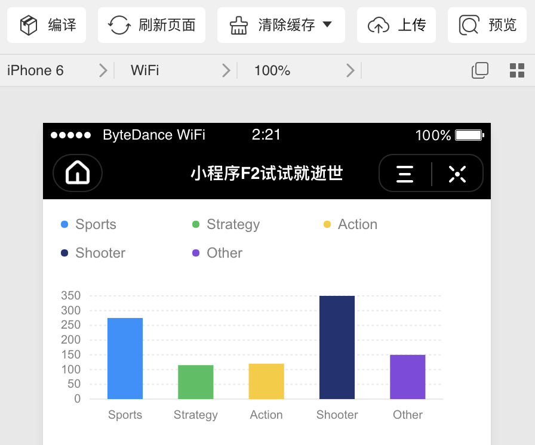

### 5.4 复诊

- 官方也在做适配努力，未来可期；
- Canvas 可以适配，GAP 是可以接受的。字节系小程序的 Canvas 2D 上下文基础库有上面这些 API 与 HTML5 标准存在 GAP，适配上有一些漏洞，但不会带来很大的根本性影响；
- 库内少量依赖了浏览器 BOM、DOM 的环境，但因为官方的有意迁移在慢慢淡出，比如前面提到的手势操作，自己实现，脱离 hammer.js，这是好的进展；
- 但是类似原来提供的允许用户引入自定义 HTML 的功能由于小程序没有 DOM 接口将会一直有缺陷。可以如何适配？提前预留节点位置？自定义节点完全转译画出来？
  - F2 官方可否提供更高程度的自定义口子，允许用户自己拓展一些插件？
    - 事实上类似这样的操作是可以实现的，对具体数据的交互发生时 F2 提供了回调入口，我的项目中就通过这样的口子自己实现了自定义的 Tooltip。

## 6. 有始有终

> 回顾总结

简单回顾一下本文的内容。

因为可视化这个话题还是比较大的，即使具体到某个特征鲜明的库，也还是有许多内容会涉及到。

1. 可视化话题上基础概念的了解，从 2.1 可视化概念介绍、图形语法引入，在此基础上讲到基于图形语法的 AntV 家的图表库和各自定位发展。然后在 2.2 有了大致的上手体会，了解使用图表库的日常场景是怎样的，感受图形语法的体现。
2. 走马观花地浏览了现有框架下 F2 是怎么设计的，主要有多少个功能模块和认知上的实体，通过简单浏览代码和数据流动，明确各自职责，而后再回到具体的使用场景中，看看这个库是怎么 work 的。
3. 后面比较详细地了解了两个功能模块的具体实现，挑选这两个功能模块也是因为觉得其比较独立，容易抽离出来弄明白，而且有一定设计构思，学习参考的价值较高。
4. 之后回到最初的起点，回到这次学习的启动背景——需求，看到在明白原理之后，遇到问题我们可以如何适配的一个小 case。

## 7. 一点思考

> 开放性话题

### 7.1 更看好、更愿意使用标榜图形语法的 G2(-Plot)、F2，还是配置化、功能化的老大哥 ECharts 之类的呢？

大哥还是大哥，用户量大和社区活跃度高。毕竟现在也是 Apache 旗下开源产品了，而且接入门槛相形之下会更低。作为前辈级的库，ECharts 也积累了很多优化实践和经验，也有许多强大工具如 ZRender，它实现了 SVG 和 Canvas 两大阵营的底层抹平，个人感觉是非常厉害的设计，把上面提到的 immediate-mode 和 retained-mode 这两个模式的标准做到统一封装，光这一点在适配性、优化上就能造就很大优势。

刚才提到了 noCode, lowCode，配置化确实是不用 code，但是 noCode, lowCode 本身的一个难点要点是定制性够不够强，虽然之前了解到的 360 团队的一个可视化编辑器，用的图表库部分就主要是 ECharts，但图形语法的描述能力可以说具有更高的灵活性和扩展性，会不会发展到某种程度的时候其实能做得更好。

### 7.x ......

更多相关话题欢迎一起思考讨论。

## 8. 资料推荐

> 学习过程中接触到不少优秀的相关资料，在这里统一整理推荐。

- [Github Antvis F2 repo](https://github.com/antvis/F2)

- [Github tt-f2 repo](https://github.com/PieNam/tt-f2)

- [力荐！吴亮老师课程「跟月影学可视化」](http://gk.link/a/10lOO)（没错这是一个分享推广入口）

- [语雀专题——正经可视化](https://www.yuque.com/neowang/zjvis/zjvis_intro)

- [图形语法相关博客一则](https://www.jianshu.com/p/f5f6ba845723)

- [G2 概念、设计、演进](https://antv-g2.gitee.io/zh/docs/manual/concepts-overview)

- [F2 渲染引擎 G 文档](https://www.yuque.com/antv/f2/api-g)

- [渲染引擎的抉择 Canvas vs. SVG](https://g2-v3.antv.vision/zh/docs/manual/tutorial/renderers)

- [AntV 架构演进——F2 篇](https://zhuanlan.zhihu.com/p/110989450)

- [AntV 同学知乎专栏——F2 架构演进](https://zhuanlan.zhihu.com/p/110989450)

- [AntV 语雀专栏——G 引擎渲染改造](https://www.yuque.com/antv/ou292n/ezkcs4)

- [AntV Canvas 局部渲染总结](https://juejin.im/post/6844904103231881229)

- [可视化课题 - Data Points 讲义](http://flowingdata.com/data-points/DataPoints-Ch3.pdf)

- [缓动效果示例](https://www.xuanfengge.com/easeing/easeing/)

- [Canvas 标准 from MDN](https://developer.mozilla.org/zh-CN/docs/Web/API/CanvasRenderingContext2D/canvas)

- [字节跳动小程序文档](https://microapp.bytedance.com/docs/zh-CN/mini-app/develop/api/interface/canvas-draw/canvas-context/)

## 9. 最后叨叨

检测学习效果的办法就是看看自己能不能简单地教会别人。

还是前端小学生，读过的源码和做过的实践还不多，此行大致地读了一下 F2 的源码，项目理解和本文的线索应该还算清晰，只是内容实在较多，或许没能看得足够深入、仔细，可能也有不少没讲清楚，甚至讲得不准确的地方。但毕竟也是学习交流，如果能在得到指教和建议的同时，给各位带来一点点帮助和视野上的拓展，或者为大家后续的拓展学习提供一点帮助和大体上的感性认识，就已经非常满足了。

**再次恳请大家能够不吝赐教。**
