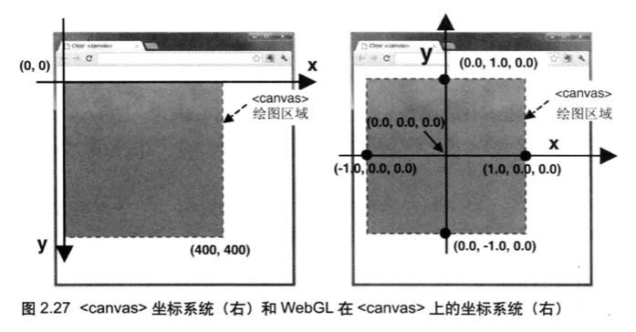
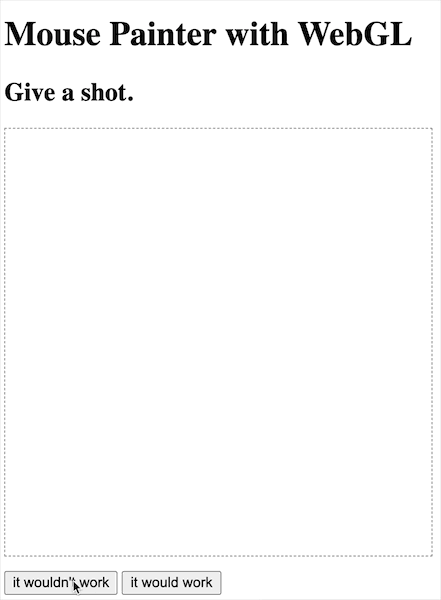
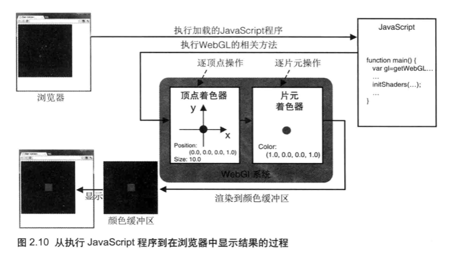

# 一起学习 WebGL (0) - 品品颜色缓冲区

> 本文是 WebGL 入门学习笔记的开篇引子，因此篇目为零。
> 
> 这个引子中，将通过一个很简单的绘制场景，对比 WebGL 与常见如 Canvas2D 之类渲染引擎的绘图过程，对 WebGL 重要的「颜色缓冲区」概念建立基本的体会和认识。

## 场景
画布功能：一张空画布，响应鼠标点击，每次在点击位置绘制一个点。


## 实现

### The One With Canvas 2D

> Playground: [Canvas2D Demo](https://jsfiddle.net/DedeDD/c2ousm5d)

实现方式很简单：在 Canvas 元素上监听 mousedown 事件，取到交互坐标之后，直接在该坐标绘制点。这里用 canvas2Dcontext.fillRect 方法绘制一个边长为 10 的正方形。

甚至不需要伪代码：

``` JavaScript
canvas.onmousedown = ({ layerX, layerY }) => {
  context.fillRect(
    layerX - SIZE / 2,
    layerY - SIZE / 2,
    SIZE,
    SIZE,
  );
};
```


Canvas 2D 上下文的绘制过程非常直观，基本上是“拟物化”的，就像一笔一划在画布上绘制一般。接下来仿照这个思路，用 WebGL 上尝试实现这个功能。

## The One(s) With WebGL

> Playground: [WebGL Demo](https://jsfiddle.net/DedeDD/pwmxae96/5/)

### 初步实现
WebGL 其实就是另一套可以在 Canvas 上绘制图形的引擎，那其与 Canvas 有什么区别，或者有什么概念上的差异呢？使用上面的方法，同样在 Canvas 的 mousedown 事件上做做文章。

WebGL 的 API 非常繁琐，编写过程比较复杂，容易引入额外的理解成本，这里只提取跟实验相关的一部分代码进行解释。

因为 WebGL 绘图的坐标与 Canvas2D 绘制的坐标，或者其作为 DOM 节点的内部坐标并不完全匹配：



_（图源：《WebGL 编程指南》中文版，第二章 P51，左为 Canvas 2D，右为 Canvas WebGL）_

对于点击事件的坐标处理，这里抽象一个坐标映射的工具函数：

``` JavaScript
const calCanvasPosition = (x, y, canvas) => {
  const { width, height } = canvas;
  return [
    (x / width) * 2 - 1,  // (x - width / 2) / (width / 2)
    -((y / height) * 2 - 1), // -((y - height / 2) / (height / 2))
  ];
}
```

使用这个坐标计算函数，将点击事件的坐标转化为 Canvas 元素上该点的 WebGL 坐标表示，并将其绘制出来：

``` JavaScript
// 清空画布，gl.COLOR_BUFFER_BIT 就是内置的当前已经设置过的底色（灰色）
gl.clear(gl.COLOR_BUFFER_BIT);

canvas.onmousedown = ({ layerX, layerY }) => {
  const point = calCanvasPosition(layerX, layerY, canvas);
  // 这里是将该点的坐标信息写入 WebGL 顶点着色器中预留好的变量里
  // 可以理解为指定要绘制的点坐标
  //（点大小、颜色已经预先设置好了，为了方便理解不赘述）
  gl.vertexAttrib2f(a_Position, ...point);
  // 这里是绘制当前顶点着色器列表集合里面，从 0 位置开始的 1 个，即第一个点
  // 可以理解为把刚才指定的点绘制出来
  gl.drawArrays(gl.POINTS, 0, 1);
};
```

很好理解吧，没什么毛病，自信运行！

……

#### 但它不 work……



这里事件监听、坐标计算、JS 代码与 GL 代码通信其实都没什么问题，问题就在于，WebGL 绘图引擎，有一个重要概念需要理解，其绘制过程中，思维模型与 Canvas2D 存在根本差异。

这个重要概念就是：

#### 颜色缓冲区

可以这么说：
- 简单理解，例子中 WebGL 的顶点着色器（用于绘制图形顶点）、片元着色器（用于绘制图形栅格化后的像素点），其实是直接作用在颜色缓冲区上的，着色器通过计算图像信息，把每一个像素点应该展示的色彩信息送到颜色缓冲区；
- 缓冲区有点像一张离屏 Canvas，在其上的绘制并不会在单个指令执行完毕的瞬间绘制到屏幕上；
- 在每次绘制结束（也就是当前绘制动作所属的 JS 同步事件循环结束之后），缓冲区中内容会被送到屏幕上，屏幕上原有内容被覆盖，缓冲区也就清空了；

再来一张图明晰一下模型：



_（图源：《WebGL 编程指南》中文版，第二章 P26）_

因此，如果只是监听 Canvas 事件，对本次点击触发的异步事件进行处理，将这个新点利用 WebGL 绘制出来，则每次画布中显示的都只有当前点。甚至因为程序只在初始化的时候用给定的灰色背景色清空了一次画布，之后的绘制中没有重新将这个背景色送给缓冲区，缓冲区会被重置为默认的颜色。

实际效果，就是每次点击之后，画布变成白色（全透明），画布中只有当前点击产生的那个点。

### 正确实现

有了上面的理论基础，要基于 WebGL 绘制引擎实现画布功能，还需要对实现方案作出修改。

颜色缓冲区在当前的理解概念上，是在一个同步事件循环中进行绘制的，并且每次颜色缓冲区都会覆盖原有的画布，那么就需要在每次绘制中都绘制出所有点击过的点。

这也很简单，将所有点坐标用数组保存，每次绘制都将这些坐标画出来就好：

``` JavaScript
// 初始化清空画布，只是为了一开始就将画布置为固定的灰色
gl.clear(gl.COLOR_BUFFER_BIT);

const points = [];

canvas.onmousedown = ({ layerX, layerY }) => {
  // 维护所有点
  points.push(calCanvasPosition(layerX, layerY, canvas));

  // 每次绘制都重置一下画布颜色
  gl.clear(gl.COLOR_BUFFER_BIT);
  // 对于每个点执行相同的操作，设置顶点着色器坐标、命令绘制当前顶点着色器的点
  points.forEach((point) => {
    gl.vertexAttrib2f(a_Position, ...point);
    gl.drawArrays(gl.POINTS, 0, 1);
  });
}
```

得嘞。


## 结语

WebGL 学习过程中，没有认识到“颜色缓冲区”概念的时候，对于上面两份看起来逻辑相当一致，实现效果却不同的代码非常困惑，只能猜测每次绘制之后画布都会清空。看到后面才发现其实是思维还有漏洞，大概学习也是不断完善思维模型的过程。

因此，作为 WebGL 学习笔记系列的开篇，希望通过这个简单的小实验，在较低的门槛之下，让读者对 WebGL 绘制过程、其与 2D 上下文模型的差异有直观的体会，希望能有所帮助，也欢迎共同学习交流。

所有例子的代码、在线编辑地址将在下面附上。

## 代码存档

### Canvas2D

> Playground: [Canvas2D Demo](https://jsfiddle.net/DedeDD/c2ousm5d)

``` HTML
<!DOCTYPE html>
<html lang="en">
<head>
  <meta charset="UTF-8">
  <title>WebGL Note (0) Demo - Mouse Painter with Canvas2D</title>
</head>
<body>
  <h1>Mouse Painter with Canvas2D</h1>
  <h2 id="demo-title">Give a shot.</h2>
  <canvas
    id="canvas-2d"
    width="410"
    height="410"
    style="border: 1px gray dashed; margin-bottom: 10px"
  >
    Canvas not supported in the container.
  </canvas>
</body>

<script>
console.log('Hello, WebGL!');

const CANVAS_SIZE = 410;
const SIZE = 10;

window.onload = () => {
  const canvas = document.getElementById('canvas-2d');
  if (!canvas) {
    console.error('Failed to get Canvas element.');
    return;
  }

  const context = canvas.getContext('2d');
  
  context.fillStyle = 'rgba(0, 0, 0, 0.3)';
  context.fillRect(0, 0, CANVAS_SIZE, CANVAS_SIZE);
  context.fillStyle = 'rgba(0, 255, 255, 1)';

        canvas.onmousedown = ({ layerX, layerY }) => {
                document.getElementById('demo-title').innerText = 'LGTM.';
    console.log({ layerX, layerY });
    context.fillRect(
      layerX - SIZE / 2,
      layerY - SIZE / 2,
      SIZE,
      SIZE,
    );
  };
};
</script>
</html>

```

### WebGL

> Playground: [WebGL Demo](https://jsfiddle.net/DedeDD/pwmxae96/5/)

``` HTML
<!DOCTYPE html>
<html lang="en">
<head>
  <meta charset="UTF-8">
  <title>WebGL Note (0) Demo - Mouse Painter with WebGL</title>
</head>
<body>
  <h1>Mouse Painter with WebGL</h1>
  <h2 id="demo-title">Give a shot.</h2>
  <canvas
    id="webgl"
    width="400"
    height="400"
    style="border: 1px gray dashed; margin-bottom: 10px"
  >
    Canvas not supported in the container.
  </canvas>
  <div>
    <button id="btn-a">it wouldn't work</button>
    <button id="btn-b">it would work</button>
  </div>
</body>

<script>
console.log('Hello, WebGL!');

/** utils from WebGL 编程指南 */
const initShaders = (gl, vshader, fshader) => {
  const program = createProgram(gl, vshader, fshader);
  if (!program) {
    console.log('Failed to create program');
    return false;
  }

  gl.useProgram(program);
  gl.program = program;

  return true;
}

const createProgram = (gl, vshader, fshader) => {
  // Create shader object
  const vertexShader = loadShader(gl, gl.VERTEX_SHADER, vshader);
  const fragmentShader = loadShader(gl, gl.FRAGMENT_SHADER, fshader);
  if (!vertexShader || !fragmentShader) {
    return null;
  }

  // Create a program object
  const program = gl.createProgram();
  if (!program) {
    return null;
  }

  // Attach the shader objects
  gl.attachShader(program, vertexShader);
  gl.attachShader(program, fragmentShader);

  // Link the program object
  gl.linkProgram(program);

  // Check the result of linking
  const linked = gl.getProgramParameter(program, gl.LINK_STATUS);
  if (!linked) {
    const error = gl.getProgramInfoLog(program);
    console.log('Failed to link program: ', error);
    gl.deleteProgram(program);
    gl.deleteShader(fragmentShader);
    gl.deleteShader(vertexShader);
    return null;
  }
  return program;
}

const loadShader = (gl, type, source) => {
  // Create shader object
  const shader = gl.createShader(type);
  if (shader == null) {
    console.log('unable to create shader');
    return null;
  }

  // Set the shader program
  gl.shaderSource(shader, source);

  // Compile the shader
  gl.compileShader(shader);

  // Check the result of compilation
  const compiled = gl.getShaderParameter(shader, gl.COMPILE_STATUS);
  if (!compiled) {
    const error = gl.getShaderInfoLog(shader);
    console.log('Failed to compile shader: ', error);
    gl.deleteShader(shader);
    return null;
  }

  return shader;
}

const calCanvasPosition = (x, y, canvas) => {
  console.log({ x, y });
  const { width, height } = canvas;
  return [
    (x / width) * 2 - 1,
    -((y / height) * 2 - 1),
  ];
}

const VSHADER_SOURCE = `
attribute vec4 a_Position;
void main() {
  gl_Position = a_Position;
  gl_PointSize = 10.0;
}
`;

const FSHADER_SOURCE = `
void main() {
  gl_FragColor = vec4(0, 1, 1, 1);
}
`;

window.onload = () => {
  const canvas = document.getElementById('webgl');
  if (!canvas) {
    console.error('Failed to get Canvas element.');
    return;
  }
  
  const gl = canvas.getContext('webgl');
  if (!initShaders(gl, VSHADER_SOURCE, FSHADER_SOURCE)) {
    console.error('Failed to initialize shaders!');
  }

  const a_Position = gl.getAttribLocation(gl.program, 'a_Position');
  if (a_Position < 0) {
    console.error('Failed to get the storage location!');
    return;
  }

  gl.clearColor(0, 0, 0, 0.3);
  
  // 这个实现是行不通的，这就是颜色缓冲区的概念。
  // 每次绘制代码执行完一个事件循环，才会将颜色缓冲区送到屏幕上，然后缓冲区就清空，
  // 下一个事件循环的绘制都会重新开始，所以单次绘制有什么东西，那就是什么东西
  function buggy() {
    document.getElementById('demo-title').innerText = '...OOPS';
    gl.clear(gl.COLOR_BUFFER_BIT);

    canvas.onmousedown = ({ layerX, layerY }) => {
      const point = calCanvasPosition(layerX, layerY, canvas);
      gl.vertexAttrib2f(a_Position, ...point);
      gl.drawArrays(gl.POINTS, 0, 1);
    };
  }
  
  function painter() {
    document.getElementById('demo-title').innerText = 'LGTM.';
    gl.clear(gl.COLOR_BUFFER_BIT);

    const points = [];
    
    canvas.onmousedown = ({ layerX, layerY }) => {
      points.push(calCanvasPosition(layerX, layerY, canvas));
      
      gl.clear(gl.COLOR_BUFFER_BIT);
      points.forEach((point) => {
        gl.vertexAttrib2f(a_Position, ...point);
        gl.drawArrays(gl.POINTS, 0, 1);
      });
    }
  }
  
  document.getElementById('btn-a').addEventListener('click', buggy);
  document.getElementById('btn-b').addEventListener('click', painter);
};
</script>
</html>
```
